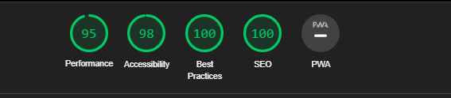

# test_spa

test single page aplication.

## Building and running on localhost

First install dependencies:

```sh
npm install
```

To create a production build:

```sh
npm run build
```

To create a development build:

```sh
npm start
```
## Test of lighthouse


## Site is available on git pages

https://viktorevstigneev.github.io/test__spa/